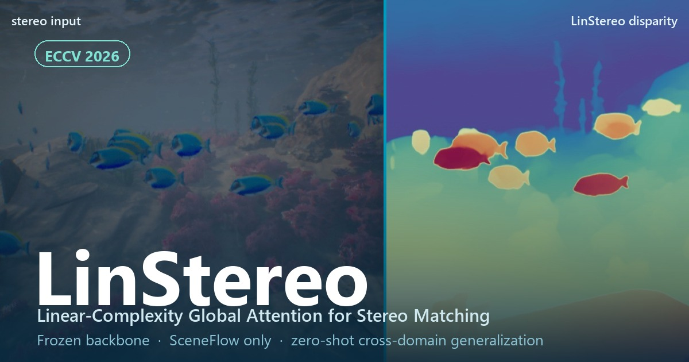
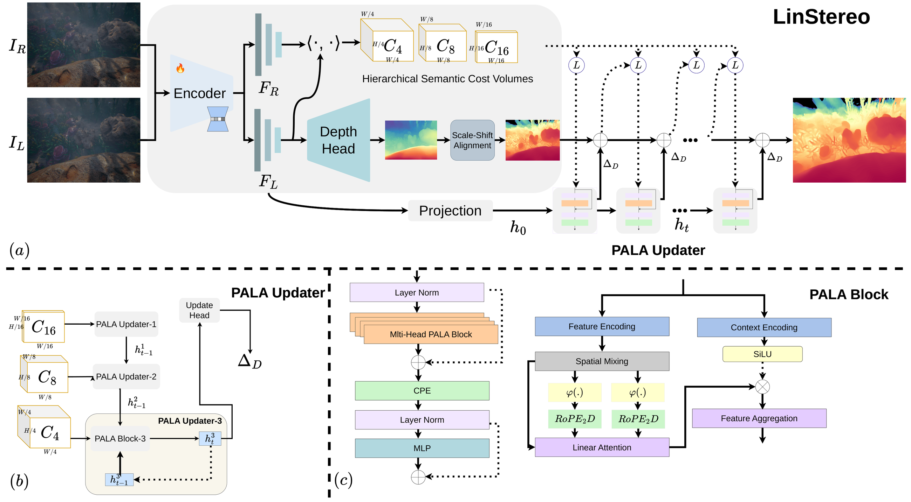

#  LinStereo: Linear-Complexity Global Attention for Multi-Scale Iterative Stereo Matching

> *"The whole is more than the sum of its parts." --- Aristotle*



> **LinStereo: Linear-Complexity Global Attention for Multi-Scale Iterative Stereo Matching**
>
> [Yiran Wang](https://u7079256.github.io/LinStereo/)<sup>1</sup>, [Oliver Turner](https://u7079256.github.io/LinStereo/)<sup>1</sup>, [Viorela Ila](https://u7079256.github.io/LinStereo/)<sup>1‡</sup>
>
> <sup>1</sup>Australian Centre for Robotics, The University of Sydney
>
> <sup>‡</sup>Corresponding author.
>
> ### [🌐 Website](https://u7079256.github.io/LinStereo/) | [📄 arXiv](https://arxiv.org/abs/2606.25437) | [📑 PDF](https://arxiv.org/pdf/2606.25437) | [🌊 SeaStereo Dataset (soon)](#) | [📌 BibTeX](#-citation)

> **TL;DR** — LinStereo redesigns the iterative stereo update loop around **Position-Aware Linear Attention (PALA)**, a global *O(N)* operator on a **frozen Depth Anything V3** backbone, so reliable disparity propagates across the whole image in a single step. It is competitive on standard benchmarks and generalizes **zero-shot** to new domains, including underwater. **Accepted to ECCV 2026.**

> [!NOTE]
> 🚧 **Code, weights, and the SeaStereo dataset are not released yet — they are coming to this repo soon.** Star ⭐ / watch 👀 to be notified.

---

## 📰 News

- **2026.06** 📄 Preprint is live on arXiv — **[arXiv:2606.25437](https://arxiv.org/abs/2606.25437)**.
- **2026.06** 🎉🎉 **LinStereo is accepted to ECCV 2026!**

**Coming soon (TODO):**

- [ ] **Pretrained weights** — release the SceneFlow-trained LinStereo checkpoint (frozen Depth Anything V3, ViT-B).
- [ ] **SeaStereo dataset** — release the ~40K-pair physically-rendered underwater corpus with dense disparity ground truth.

---

## ✏️ Citation

If you find our work helpful, please consider starring ⭐ this repo and citing:

```bibtex
@inproceedings{wang2026linstereo,
  title={LinStereo: Linear-Complexity Global Attention for Multi-Scale Iterative Stereo Matching},
  author={Wang, Yiran and Turner, Oliver and Ila, Viorela},
  booktitle={European Conference on Computer Vision (ECCV)},
  year={2026},
  eprint={2606.25437},
  archivePrefix={arXiv},
  primaryClass={cs.CV}
}
```

---

## 🏃 Intro

**LinStereo** is a **general** deep stereo-matching method. Iterative stereo updaters rely on *local* operators (ConvGRUs), so reliable matches diffuse only a few pixels per step and struggle wherever local photometric cues collapse — textureless, non-Lambertian, or light-scattering (underwater) scenes. LinStereo replaces the local updater with a **global, linear-complexity** one and reads geometry priors from a frozen monocular foundation model.

**Key components:**

- 🧭 **Position-Aware Linear Attention (PALA)** — a global attention update operator with **O(N)** complexity in the number of pixels. Reliable disparity propagates across the *whole* image in a single step, at roughly the per-iteration cost of a local ConvGRU.
- 🧱 **Hierarchical Semantic Cost Volume (HSCV)** — multi-scale cost construction guided by foundation-model semantics.
- 🎯 **Depth Prior Initialization (DPI)** — initializes the iterative loop from the backbone's monocular depth prior for faster, more stable convergence.
- ❄️ **Frozen Depth Anything V3 backbone** (DINOv2 ViT-B/14 + Dual-DPT head) — no backbone fine-tuning; trained on **SceneFlow only**.
- 🌍 **Zero-shot generalization** — strong on standard benchmarks *and* unseen domains (real-world & synthetic underwater) with **no** domain-specific data.



---

## ⚡ Quick Start

> 🚧 **Code release is coming soon.** The snippet below shows the *intended* API and will be updated when the code lands in this repo.

```python
# (planned API — not yet available)
import torch
from linstereo import LinStereo

model = LinStereo.from_pretrained("u7079256/LinStereo").eval().cuda()

left  = load_image("left.png")    # (B, 3, H, W)
right = load_image("right.png")
disparity = model(left, right, iters=8)   # (B, 1, H, W)
```

---

## ⚖️ Weights

> 🚧 Pretrained weights will be released here.

| Model | Backbone | Training data | Link |
|---|---|---|---|
| **LinStereo** | Depth Anything V3 · ViT-B/14 (frozen) | SceneFlow only | 🚧 Coming soon |

---

## 📦 SeaStereo Dataset

We release **SeaStereo**, a physically-rendered underwater stereo corpus with **dense disparity ground truth**.

| Stereo pairs | Jerlov water types | Configurations | Ground truth |
|---|---|---|---|
| ~40K | 7 | 1000+ | dense disparity |

> **Rendering pipeline:** ShapeNetCore foreground objects composited over real marine backgrounds (coral, fish, shipwrecks) and rendered in Blender under varying Jerlov water types.
>
> 🚧 Download coming soon.

---

## 📐 PALA vs. ConvGRU

PALA is a **global** update operator, yet its **per-iteration** latency is on par with the **local** ConvGRUs it replaces (480×640, single NVIDIA RTX 4500):

| Update operator | Latency (ms) ↓ |
|---|---|
| **PALA (Ours)** | **3.50 ± 0.05** |
| RAFT-Stereo ConvGRU | 3.63 ± 0.06 |
| IGEV ConvGRU | 3.43 ± 0.03 |

LinStereo is a large, **accuracy-first** model (frozen Depth Anything V3 backbone) rather than a lightweight real-time network — see the [website](https://u7079256.github.io/LinStereo/#efficiency) for the full efficiency table.

---

## 🧪 Zero-Shot Results

All methods below are trained on SceneFlow (IGEV++ uses extra training data). Numbers mirror the paper; the **full tables with all baselines and best/second-best highlighting** are on the [website](https://u7079256.github.io/LinStereo/).

### Standard benchmarks — EPE

| Method | KITTI'15 | KITTI'12 | Midd(H) Occ | ETH3D | Booster(Q) |
|---|---|---|---|---|---|
| RAFT-Stereo | 1.13 | 0.90 | 3.31 | 0.36 | 4.18 |
| MGStereo | 1.13 | 0.87 | 2.89 | 0.25 | 2.26 |
| Stereo Anywhere | 1.07 | 0.83 | 2.67 | 0.24 | 2.21 |
| IGEV++ (+extra) | 1.27 | 1.20 | 6.83 | 0.35 | 5.00 |
| **LinStereo (Ours)** | 1.01 | 0.76 | **1.33** | 0.24 | 2.14 |

> LinStereo's **1.33** occluded-EPE on Middlebury is **37% below** the previous best (DEFOM, 2.11).

### Underwater — Rel ↓ / RMSE ↓

| Method | TartanAir-UW Rel | TartanAir-UW RMSE | SQUID Rel | SQUID RMSE |
|---|---|---|---|---|
| RAFT-Stereo | 0.08 | 4.36 | 0.07 | 1.25 |
| MGStereo | 0.08 | 3.69 | 0.09 | 1.99 |
| Stereo Anywhere | 0.06 | 3.24 | 0.07 | 1.46 |
| IGEV++ (+extra) | 0.09 | 4.37 | 0.06 | 1.11 |
| **LinStereo (Ours)** | **0.04** | **2.08** | **0.04** | **0.90** |

> **Best on every metric** on both benchmarks — **9.8%** lower AbsRel and **31%** lower RMSE on TartanAir-UW, **24.3%** lower AbsRel and **33%** lower Rel on SQUID.

### Real-world lab tank — Rel ↓ / RMSE ↓ / A1 ↑

| Method | Rel | RMSE | A1 |
|---|---|---|---|
| RAFT-Stereo | 0.06 | 0.15 | 0.94 |
| MGStereo | 0.08 | 0.18 | 0.93 |
| Stereo Anywhere | 0.09 | 0.20 | 0.92 |
| IGEV++ (+extra) | 0.05 | 0.12 | 0.96 |
| **LinStereo (Ours)** | **0.04** | **0.07** | **0.98** |

> Close-range (< 2 m) water tank with AprilTag + CAD-model ground truth to sub-millimetre, including ~3 mm taut ropes as a fine-structure stress test.

---

## 😘 Acknowledgement

- We thank **Jay Zhang** and **Dr. Gideon Billings** for help collecting the real-world underwater data.
- LinStereo builds on a frozen **[Depth Anything V3](https://github.com/DepthAnything/Depth-Anything-V2)** backbone, and our evaluation follows recent stereo work — **[RAFT-Stereo](https://github.com/princeton-vl/RAFT-Stereo)**, **[IGEV / IGEV++](https://github.com/gangweiX/IGEV-Stereo)**, **[Stereo Anywhere](https://github.com/bartn8/stereoanywhere)**, **[DEFOM-Stereo](https://github.com/Insta360-Research-Team/DEFOM-Stereo)**, **[MGStereo](https://github.com/yao-shu-yu/MGStereo)**.

---

## 📜 License

The code, pretrained weights, and **SeaStereo** dataset will be released for **non-commercial research use** (CC BY-NC-SA 4.0). Final license terms will accompany the code release.
